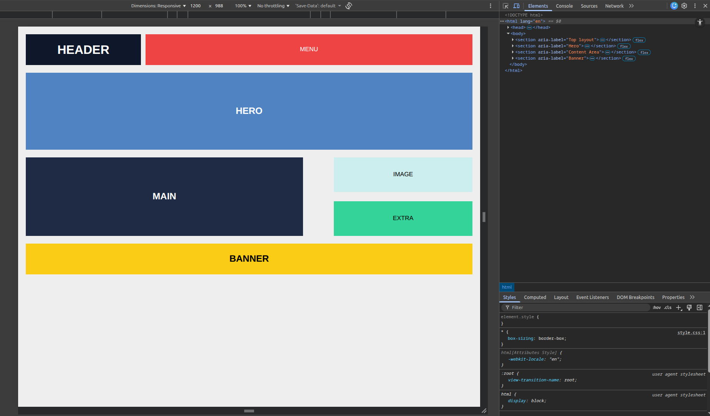
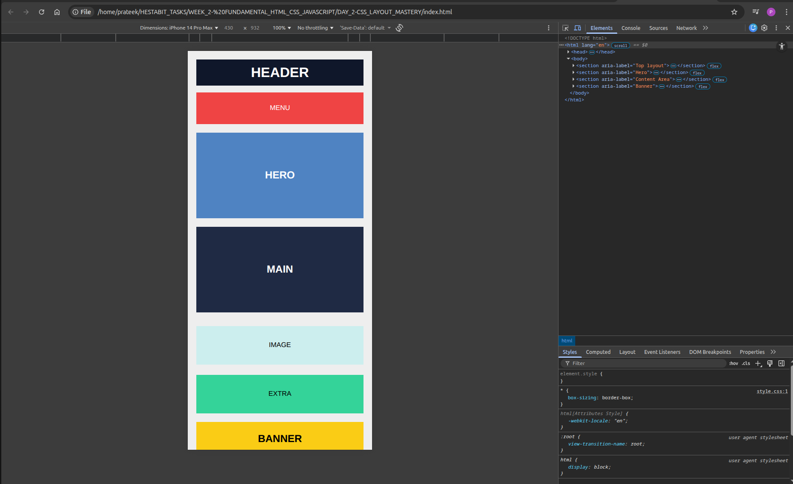
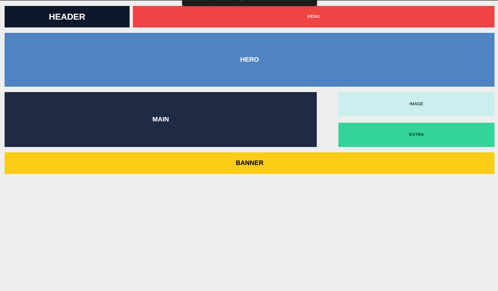

# Day 2 – CSS Layout Mastery (Flexbox + Grid)

## 🎯 Objective
Build modern responsive layouts using CSS Flexbox and Grid, applying mobile-first design principles and CSS selectors/specificity.

---

## 📚 Topics Covered

| Topic | Activity |
|---|---|
| CSS Selectors & Specificity | Selector challenges |
| Flexbox | Built navbar + hero section |
| CSS Grid | Product grid layout (2 / 3 / 4 col based on width) |
| Responsive Approach | Converted desktop → mobile-first |

---

## 🧪 Exercise

Replicated a UI screenshot provided by the mentor using Flexbox and CSS Grid.

**Reference Image:** [Mentor UI Reference](https://cdn.mos.cms.futurecdn.net/gnvkfwLFzB7yGtbTjzqURA.jpg)

---

## ✅ Deliverables

- `index.html` — Semantic HTML structure
- `style.css` — All Flexbox, Grid, and responsive styles
- `screenshots/` — UI comparison screenshots

---

## 📸 Screenshots

### 🖥️ Desktop UI


### 📱 Mobile UI


### 📐 Responsive UI


---

## 🧠 Key Learnings

### CSS Selectors & Specificity
- Attribute selectors (`[type="text"]`), sibling selectors (`+`, `~`), and pseudo-classes (`:nth-child()`)
- Specificity order: inline styles > ID > class/attribute > element
- `!important` overrides all — use sparingly

### Flexbox
- `display: flex` enables one-dimensional layouts (row or column)
- Key properties: `justify-content`, `align-items`, `flex-wrap`, `gap`
- Used for navbar alignment and hero section layout

### CSS Grid
- `display: grid` enables two-dimensional layouts
- Used `grid-template-columns: repeat(auto-fit, minmax(...))` for responsive columns
- Product grid adapts: 1 col (mobile) → 2 col (tablet) → 3/4 col (desktop)

### Responsive Design (Mobile-First)
- Started with base styles for mobile, then used `@media (min-width: ...)` to scale up
- Units used: `rem` for font sizes, `vw`/`vh` for viewport-relative sizing, `%` for fluid widths

---

## 📁 Folder Structure

```
DAY_2-CSS_LAYOUT_MASTERY/
├── index.html
├── style.css
├── style.css1
└── screenshots/
    ├── DESKTOP_UI.png
    ├── MOBILE_UI.png
    └── RESPONSIVE_UI.png
```
