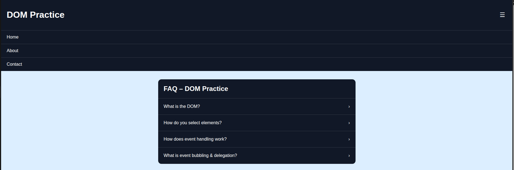
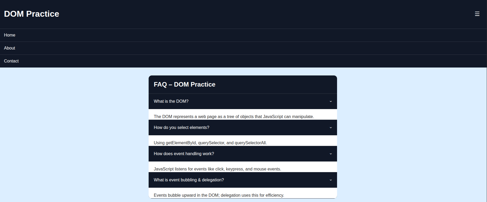
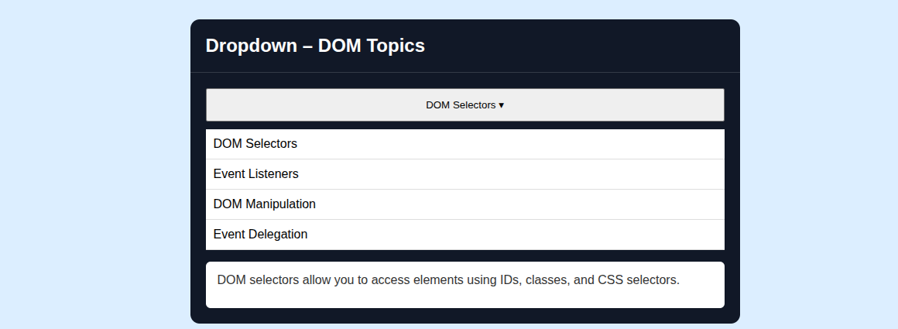
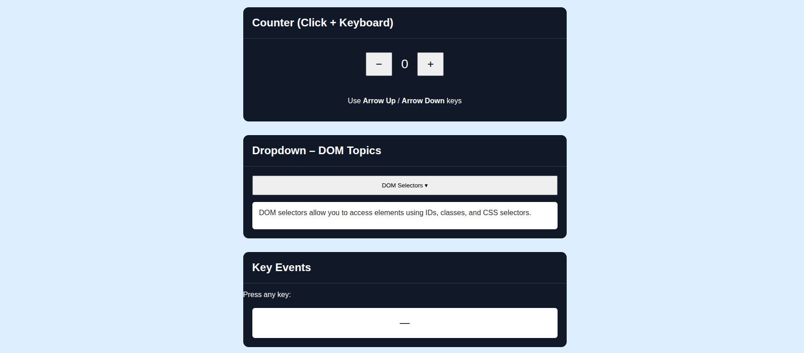

# Day 3 – JavaScript ES6 + DOM Manipulation

## 🎯 Objective
Write modern JavaScript (ES6+) and manipulate the DOM without any frameworks — building interactive UI components from scratch.

---

## 📚 Topics Covered

| Topic | Activity |
|---|---|
| Variables & Functions | `let`/`const`, arrow functions |
| Arrays & Objects | `map`, `filter`, `reduce` mini-challenges |
| DOM Manipulation | Navbar toggle, dropdown, modal |
| Event Listeners | Counter + keyboard events |

---

## 🧪 Exercise

Built an **interactive FAQ Accordion** using vanilla JavaScript — click to expand/collapse answers.

**Reference Image:** [FAQ Accordion Reference](https://codeconvey.com/wp-content/uploads/2020/02/responsive-accordion-pure-css.png.webp)

---

## ✅ Deliverables

- `index.html` — Semantic HTML structure
- `style.css` — Styling for accordion, counter, dropdown
- `script.js` — All ES6 JavaScript logic

---

## 📸 Screenshots

### 🔒 Accordion – Closed State


### 📂 Accordion – Opened State


### 🔽 Dropdown – Opened State


### 🔢 Counter – Arrow Up
.png)

### 🔢 Counter – Arrow Down
.png)

### ⌨️ Counter, Dropdown & Key Events


---

## 🧠 Key Learnings

### Variables & Functions
- `let` for block-scoped mutable variables, `const` for constants — avoid `var`
- Arrow functions: `const greet = (name) => \`Hello, ${name}\``
- Shorter syntax, and `this` is lexically scoped in arrow functions

### Arrays & Objects
- `map()` — transforms each element and returns a new array
- `filter()` — returns elements that pass a condition
- `reduce()` — accumulates array values into a single result
- Destructuring: `const { name, age } = user`
- Spread operator: `const newArr = [...arr, newItem]`

### DOM Manipulation
- Selected elements using `querySelector` / `querySelectorAll`
- Toggled classes with `classList.toggle()` for accordion open/close
- Dynamically created and injected HTML with `innerHTML` and `createElement`
- Built navbar toggle, dropdown menu, and modal with pure JS

### Event Listeners
- `addEventListener('click', fn)` for button interactions
- `addEventListener('keydown', fn)` for keyboard events (arrow up/down for counter)
- Used `event.key` to detect which key was pressed

---

## 📁 Folder Structure

```
DAY_3-JS_DOM_MANIPULATION/
├── index.html
├── style.css
├── script.js
└── screenshots/
    ├── closed_state.png
    ├── opened_state.png
    ├── dropdown_opened_state.png
    ├── counter(arrow_up).png
    ├── counter(arrow_down).png
    └── counter_dropdown_and_keyevents.png
```
