# Day 4 – JS Utilities + LocalStorage Mini-Project

## 🎯 Objective
Build modular JavaScript utilities and a fully persistent Todo App using LocalStorage — with DevTools debugging practice throughout.

---

## 📚 Topics Covered

| Topic | Activity |
|---|---|
| Debugging DevTools | Breakpoints, watch, step in/over/out |
| Custom JS Utilities | `debounce`, `throttle`, `groupBy` |
| LocalStorage Project | Todo App (persist on refresh) |
| Error Handling | `try/catch` + error boundary (`logs/errors.md`) |

---

## 🧪 Exercise

Built a **Todo App** with full LocalStorage persistence:
- ➕ Add tasks
- ✏️ Edit tasks
- ✅ Mark as complete
- 🗑️ Delete tasks
- 🔄 Persists after page refresh

---

## ✅ Deliverables

- `todo-app/` — Full Todo App source code
- `todo-app/Screenshots/` — DevTools debugging screenshots for each operation

---

## 📸 Screenshots

### ➕ Add Todo

| Step | Screenshot |
|---|---|
| Text added into input | 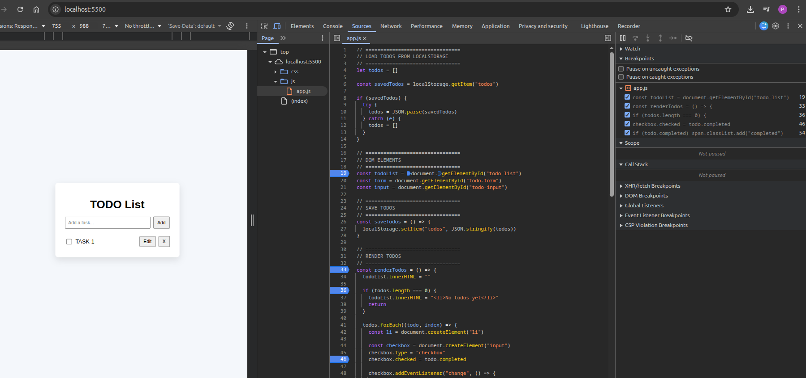 |
| Debugging paused | 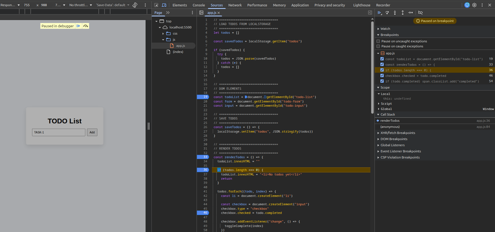 |
| Step Over | 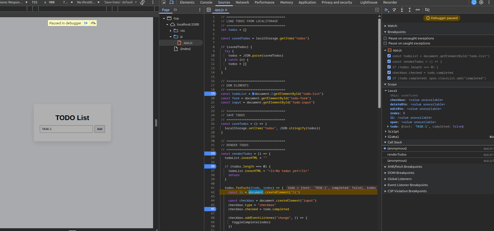 |
| Step In | 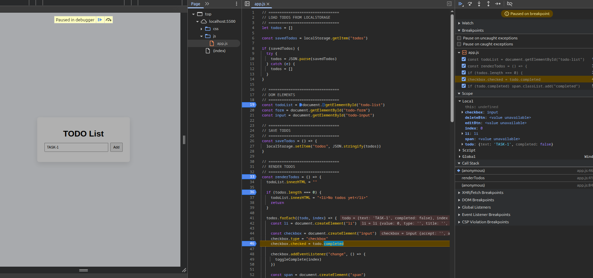 |
| Step Out | 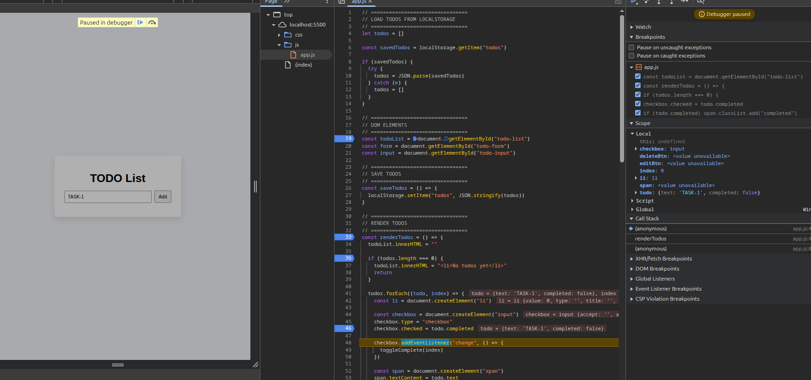 |

---

### ✅ Complete Todo

| Step | Screenshot |
|---|---|
| Task marked complete | 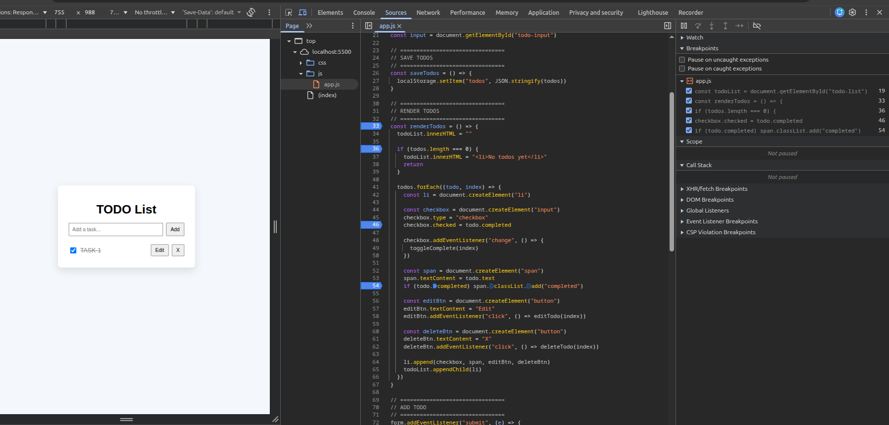 |
| Debugging paused | 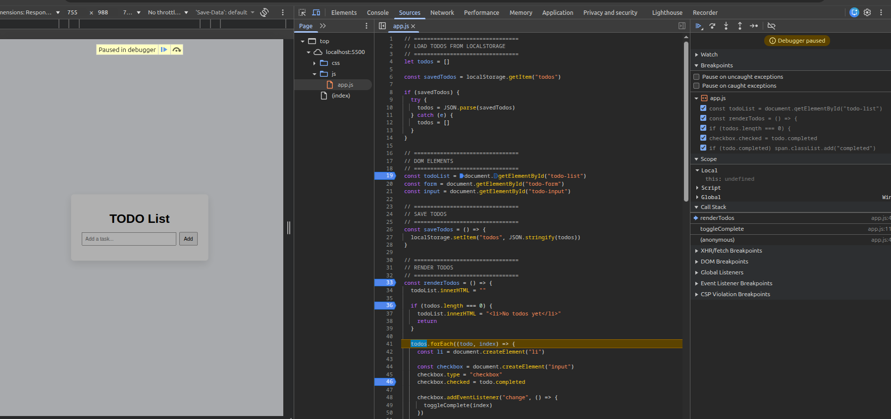 |
| Step Over | 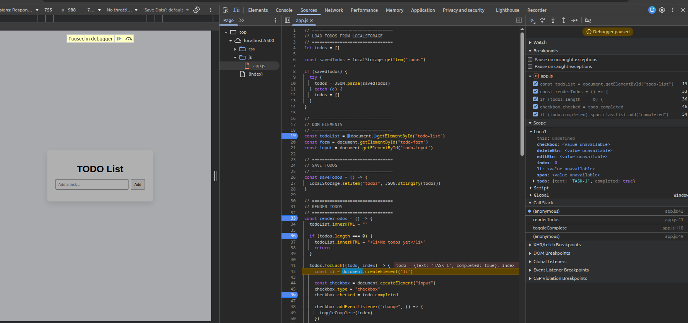 |
| Step In | 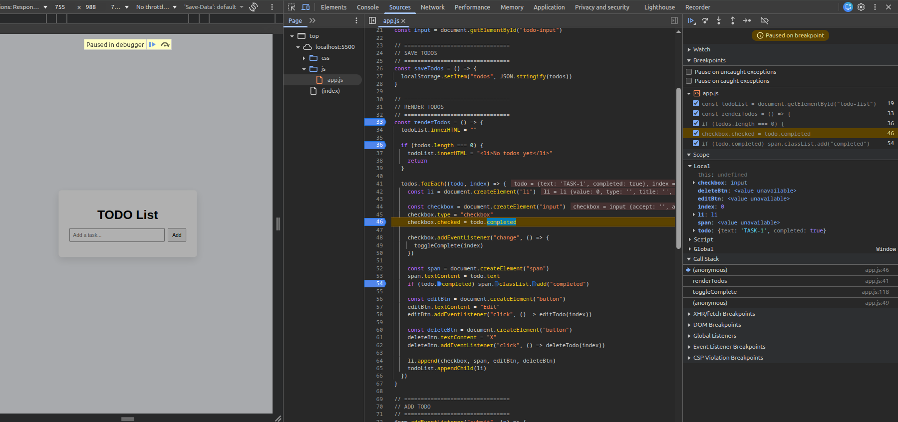 |
| Step Out | 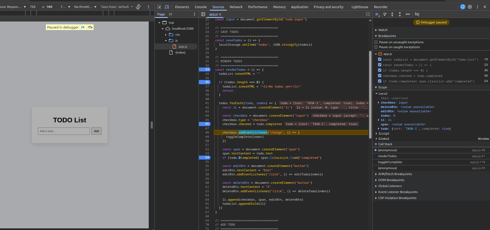 |

---

### 🗑️ Delete Todo

| Step | Screenshot |
|---|---|
| Task deleted | 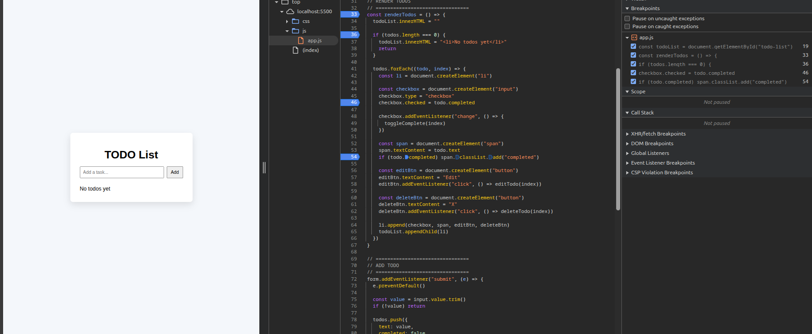 |
| Event deletion | 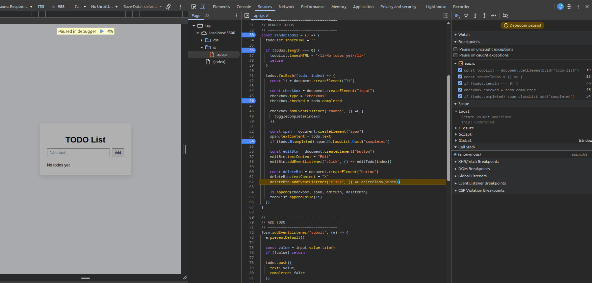 |
| Debugging paused | 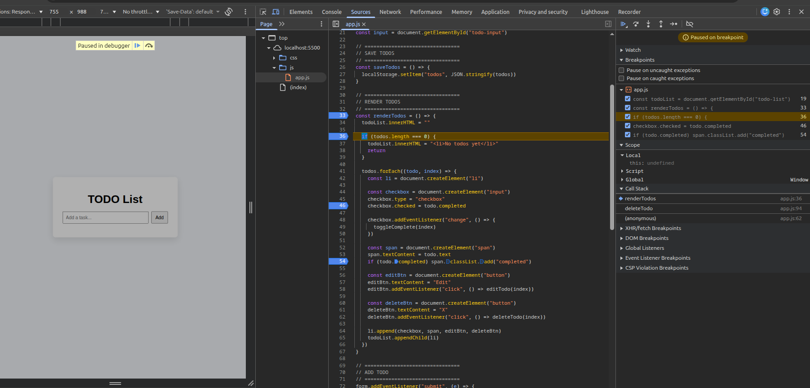 |
| Step Over | 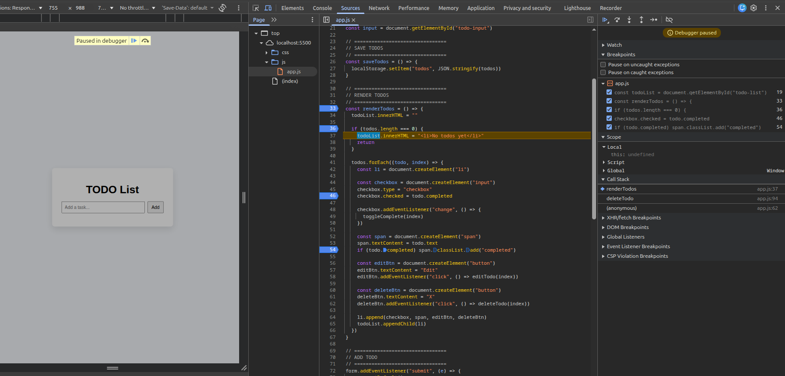 |
| Step Into | 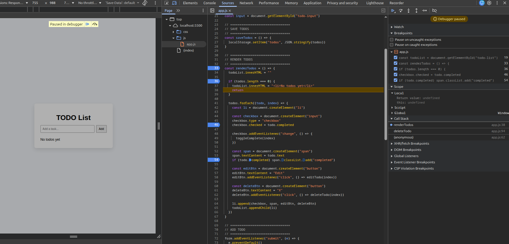 |
| Step Out | 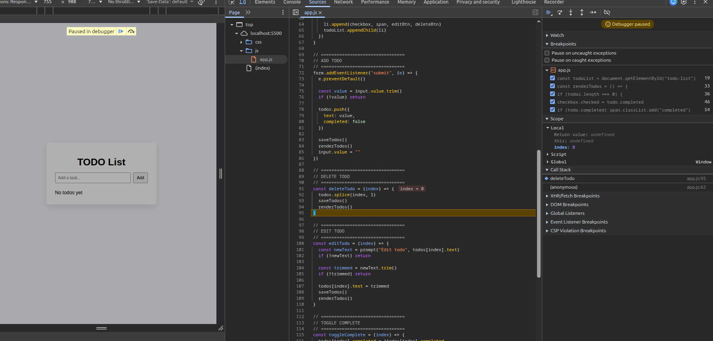 |

---

### ✏️ Edit Todo

| Step | Screenshot |
|---|---|
| Edit prompt | 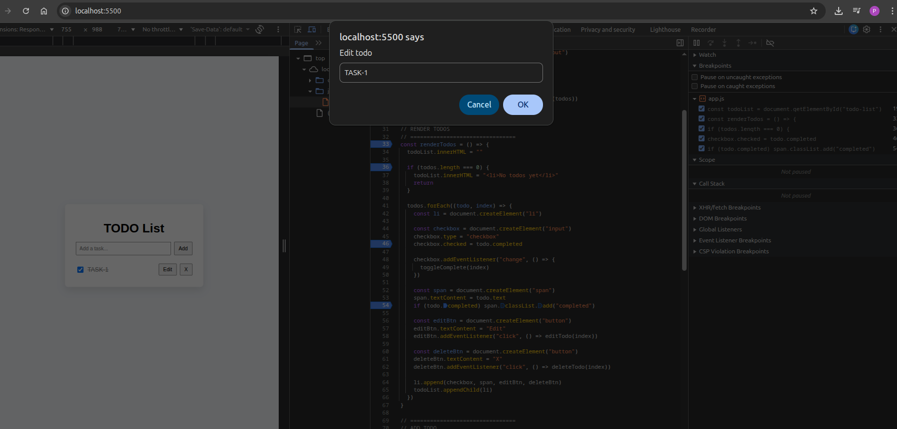 |
| Task name edited | 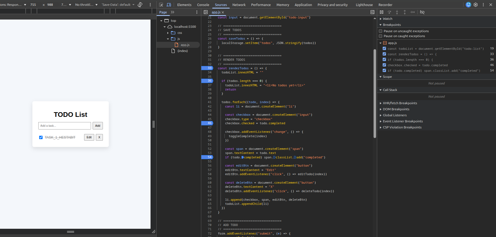 |
| Debugging paused | 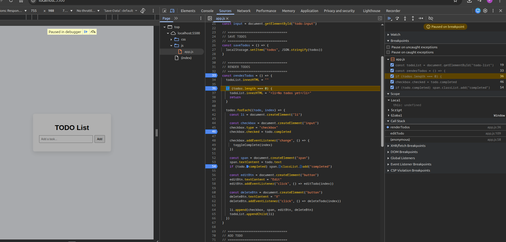 |
| Step Over | 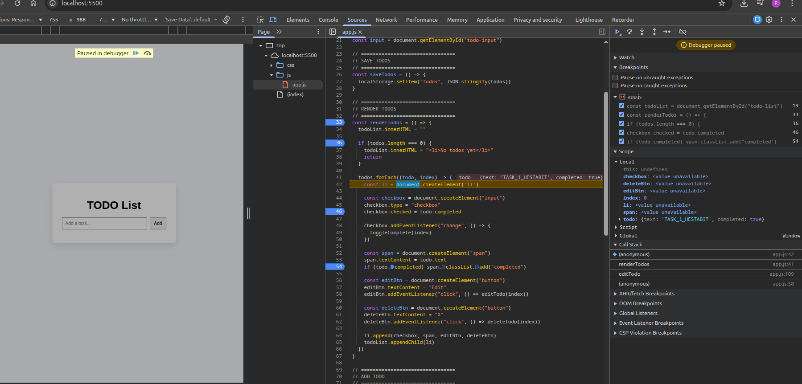 |
| Step In | 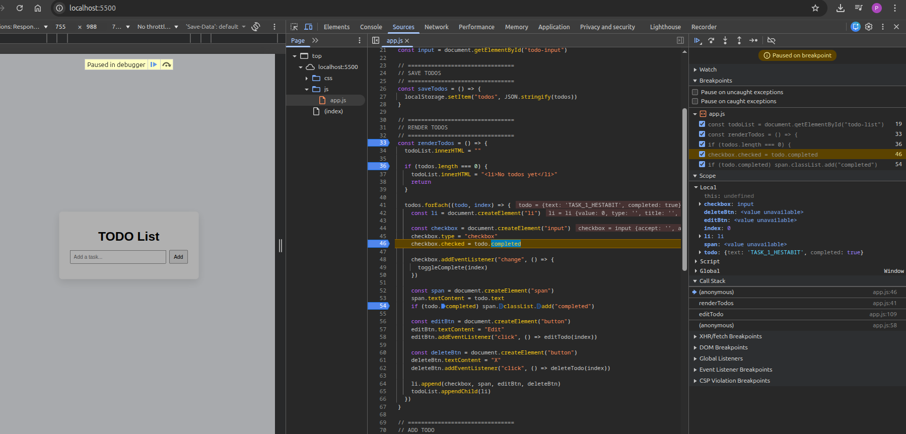 |
| Step Out |  |

---

## 🧠 Key Learnings

### Debugging with DevTools
- Set **breakpoints** directly in the Sources tab to pause execution
- Used **Step Over** (`F10`) to execute line by line without entering functions
- Used **Step In** (`F11`) to dive inside a function call
- Used **Step Out** (`Shift+F11`) to exit the current function
- **Watch** panel to monitor variable values in real time

### Custom JS Utilities
- **debounce** — delays function execution until after a pause in events (e.g. search input)
- **throttle** — limits how often a function fires (e.g. scroll/resize handlers)
- **groupBy** — groups array items by a key using `reduce()`

### LocalStorage
- `localStorage.setItem(key, JSON.stringify(data))` — save data
- `localStorage.getItem(key)` — retrieve data
- `JSON.parse()` to convert string back to object/array
- Data persists across page refreshes and browser sessions

### Error Handling
- `try/catch` blocks to gracefully handle runtime errors
- Logged errors to `logs/errors.md` for traceability
- Wrapped LocalStorage reads in `try/catch` to handle corrupted data

---

## 📁 Folder Structure

```
DAY_4-JS_UTILS_LOCALSTORAGE/
└── todo-app/
    ├── index.html
    ├── style.css
    ├── script.js
    └── Screenshots/
        ├── ADD_TODO/
        │   ├── debugging_paused.png
        │   ├── step_in_function.png
        │   ├── step_out_function.png
        │   ├── step_over_function.png
        │   └── text_added_into_function.png
        ├── COMPLETION_TODO/
        │   ├── Debugging_paused.png
        │   ├── step_in_function.png
        │   ├── step_out_function.png
        │   ├── step_over_function.png
        │   └── task_complete_todo.png
        ├── DELETE_TODO/
        │   ├── deletion_debugging_paused.png
        │   ├── event_deletion.png
        │   ├── step_into_function.png
        │   ├── step_out_function.png
        │   ├── step_over_function.png
        │   └── task_deleted.png
        └── EDIT_TODO/
            ├── debugging_paused.png
            ├── edit_task_name.png
            ├── step_in.png
            ├── step_out.png
            ├── step_over.png
            └── task_edit_prompt.png
```