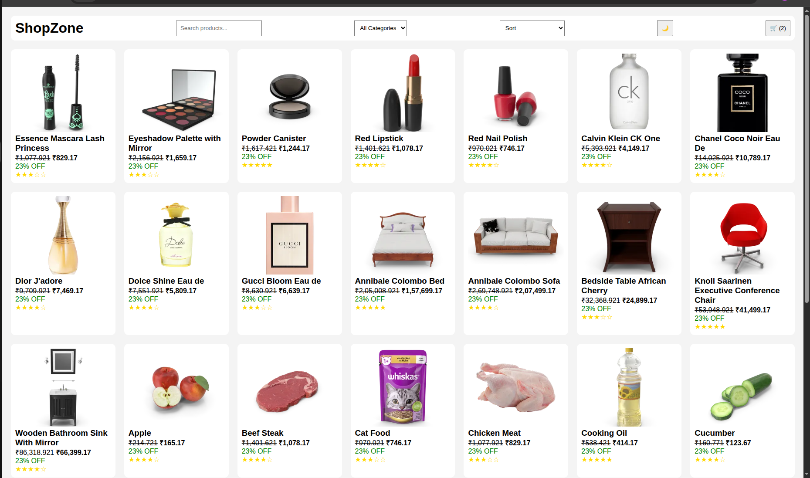
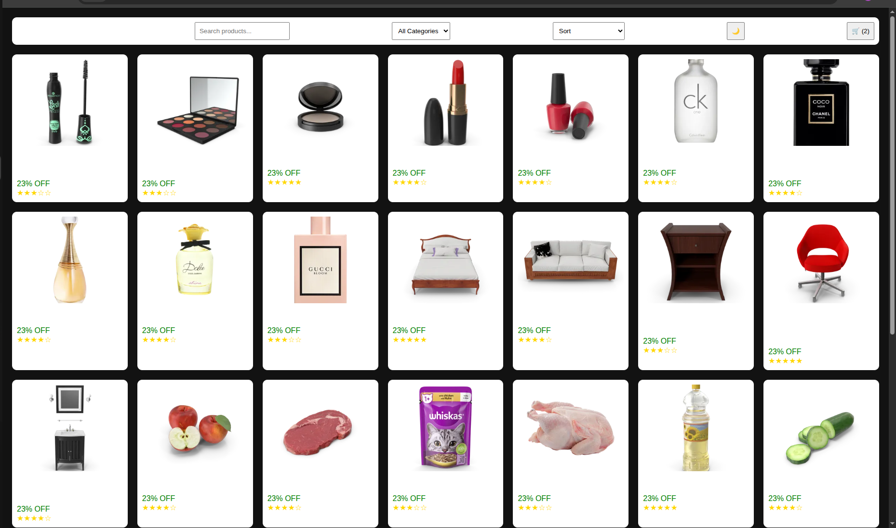
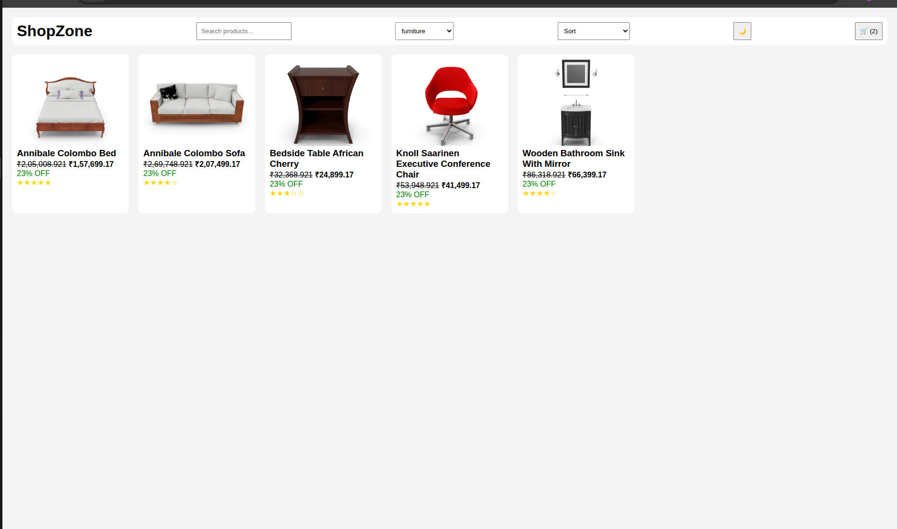

# Day 5 – Capstone UI + JS Project (E-Commerce Product Listing)

## 🎯 Objective
Combine everything learned in Week 2 — HTML5, CSS (Flexbox/Grid), and JavaScript ES6 — into a fully functional, responsive E-Commerce product listing page.

---

## 📚 Topics Combined

| Activity | Output |
|---|---|
| Project Setup | Folder structure + planning |
| UI using HTML + CSS | Skeleton with Flexbox/Grid layout |
| JS Fetch + Rendering + Search | Functional product listing UI |
| Final Touches / Responsive / Polish | Mobile-first responsive layout |

---

## 🛒 Project: Mini E-Commerce Product Listing Page

### Features
- 🔗 **Fetch API** — Products fetched live from `https://dummyjson.com/products`
- 🃏 **Product Cards** — Displays title, image, and price for each product
- 🔍 **Search Bar** — Filter products by name in real time
- 🔃 **Sort** — Sort products by price (High → Low / Low → High)
- 📱 **Mobile Responsive** — Mobile-first layout using CSS Grid & media queries
- 🌙 **Dark Mode** — Toggle between light and dark themes
- 🗂️ **Categories** — Browse products by category

**Reference Image:** [E-Commerce UI Reference](https://codehim.com/wp-content/uploads/2021/09/bootstrap-5-ecommerce-product-list-navbar-and-hover-effects.png)

---

## ✅ Deliverables

- `index.html` — Homepage
- `products.html` — Product listing page with fetch, search, sort
- `style.css` — All styling (Flexbox, Grid, responsive, dark mode)
- `script.js` — Fetch API, DOM rendering, search, sort logic
- `screenshots/` — UI screenshots

---

## 📸 Screenshots

### 🛍️ E-Commerce UI


### 🌙 Dark Mode


### 🗂️ Categories UI


---

## 🧠 Key Learnings

### Fetch API
- Used `fetch('https://dummyjson.com/products')` to load live product data
- Chained `.then(res => res.json())` to parse the response
- Wrapped in `try/catch` for error handling on failed requests
- Rendered data dynamically into the DOM after fetch resolves

### DOM Rendering
- Built product cards dynamically using `createElement` and `innerHTML`
- Used `map()` to transform API data into card HTML strings
- Appended all cards to a grid container using `insertAdjacentHTML`

### Search & Filter
- Used `addEventListener('input', fn)` on the search bar for real-time filtering
- Filtered product array with `.filter()` matching `product.title.toLowerCase()`
- Re-rendered the product grid on every keystroke

### Sort
- Sorted product array using `.sort((a, b) => b.price - a.price)` for High → Low
- Triggered re-render after sort to reflect updated order in the UI

### Responsive Design
- Mobile-first approach: base styles for small screens, scaled up with `@media (min-width: ...)`
- CSS Grid with `repeat(auto-fill, minmax(250px, 1fr))` for fluid product columns
- 1 column on mobile → 2 on tablet → 3-4 on desktop

### Dark Mode
- Toggled a `.dark` class on `<body>` using a button click
- Used CSS variables (`--bg`, `--text`, `--card-bg`) to switch themes cleanly
- Saved preference to `localStorage` to persist across refreshes

---

## 📁 Folder Structure

```
DAY_5-CAPSTONE_UI_AND_JS_PROJECT/
├── index.html
├── products.html
├── style.css
├── script.js
└── screenshots/
    ├── E-commerce_UI.png
    ├── E-commerce_Dark_Mode.png
    └── Categories_ui.png
```